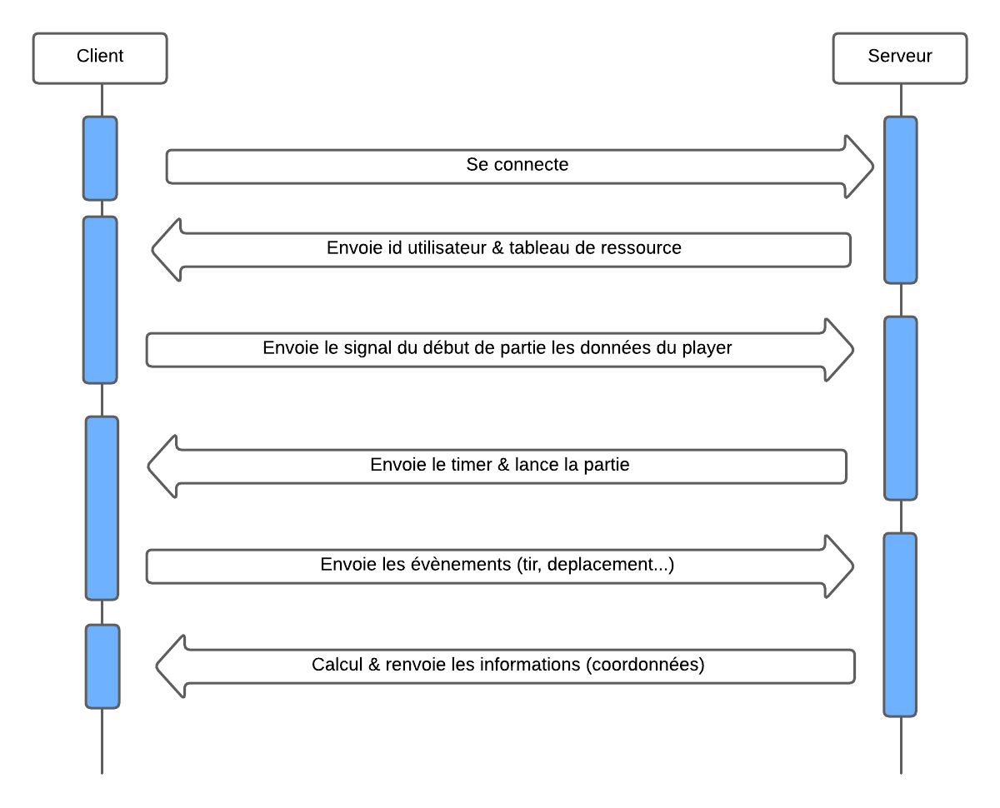

# JSAé-2023/2024-groupeH-Bouin-Belguebli-Decoster

> Auteur Julien Bouin, Mathis Decoster, Rayane Belguebli

### Diagramme de séquence 

### Difficultés techniques

Comme difficultés techniques nous avons eu l'implémentation de l'architecture client/serveur plus précisément la migration d'un jeu 100% client à un jeu client /server. Nous avons eu aussi les tests plus spécifiquement dès qu'ont amélioré ou qu'ont changé un peu le code pour résoudre de nouveaux problèmes il fallait de nouveau refaire les tests. Et pour finir l'utilisation de la classe Image savoir où est qu'on pouvait l'utiliser et la récupérer.

### Points d'amélioration

Comme amélioration on aurait pu ajouter ce qu'on avait prévu au début comme issue : 
- Projectiles Ennemis
- Ajout difficulté
- Gestion de compte joueur
- Personnalisation Avatar
- Personnalisation Ennemie

### Notre fierté

Nous sommes fier d'avoir un jeu jouable en multi.